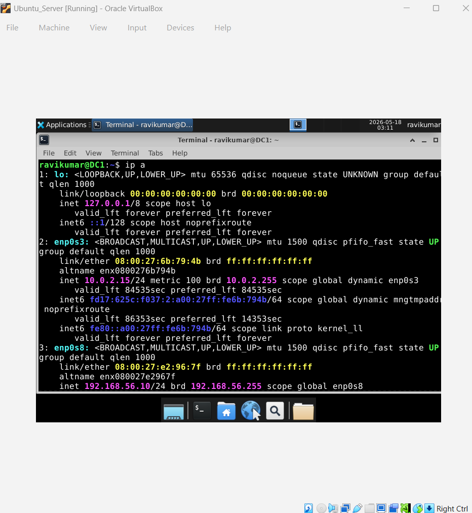
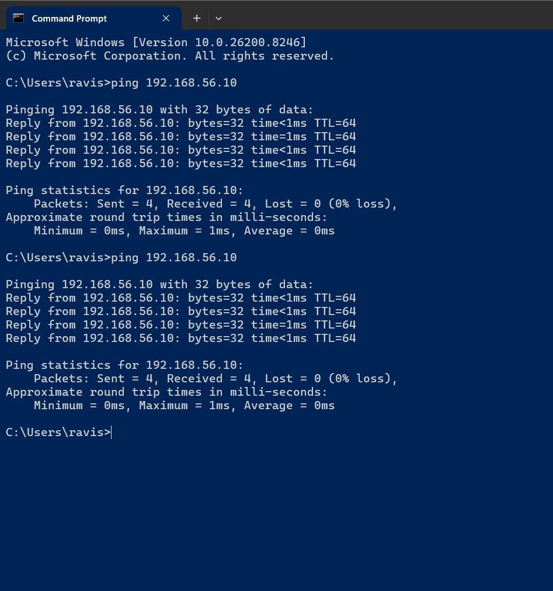
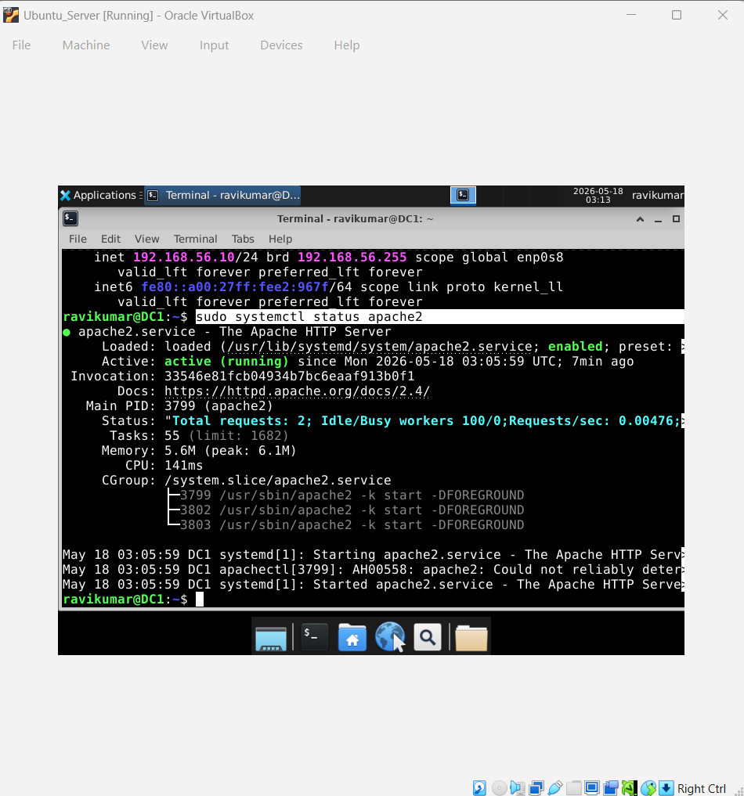
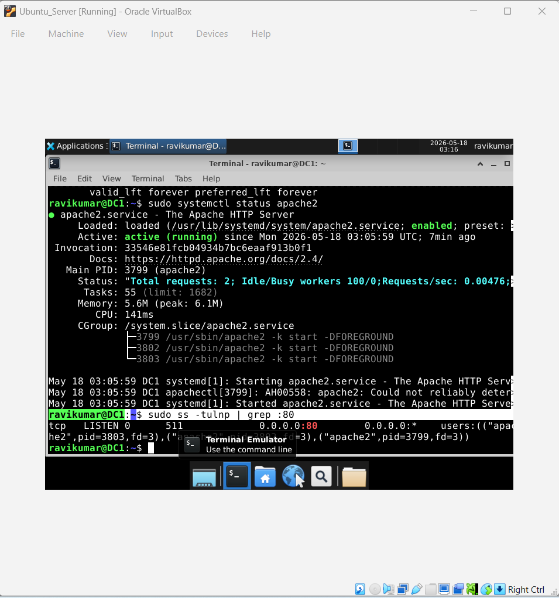
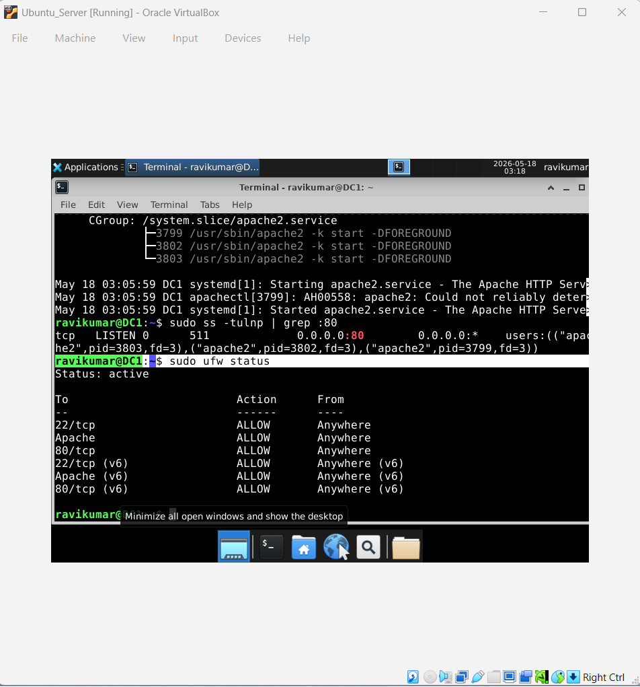
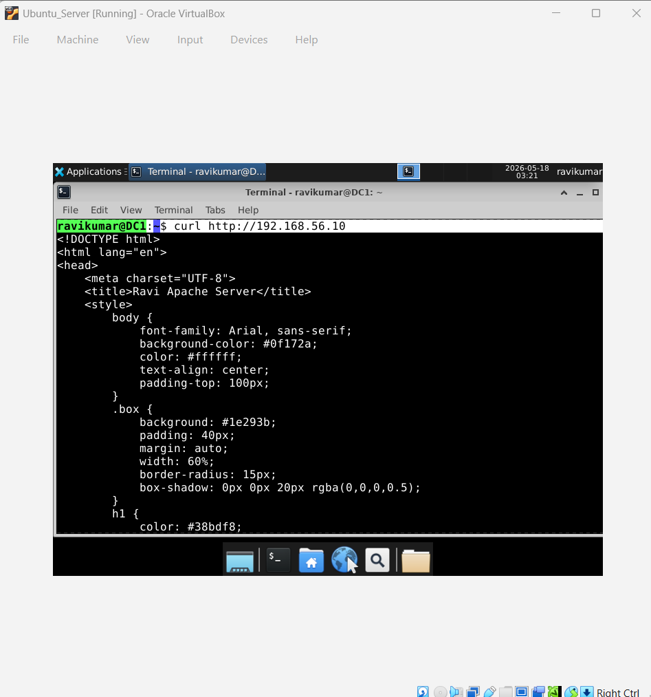
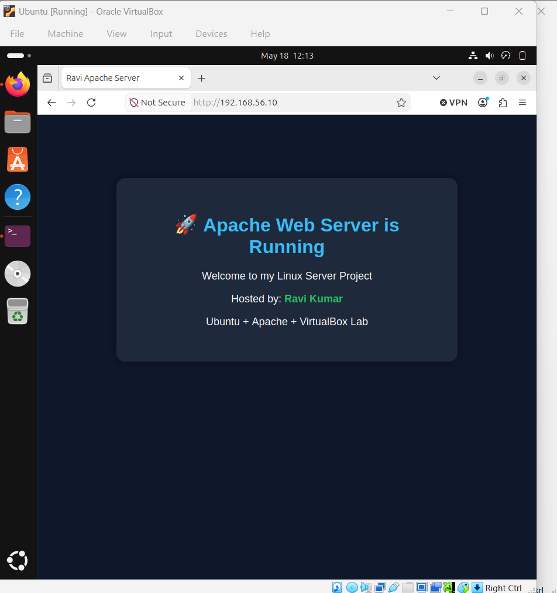

 # Ubuntu Apache Web Server Project

 # Project Title

Apache Web Server Deployment on Ubuntu (VirtualBox) with Custom HTML Page

# Overview

This project demonstrates how to set up a fully working Apache web server on Ubuntu Linux inside a VirtualBox environment and host a custom HTML webpage.

The webpage is customized with my name (Ravi Kumar) and serves as a simple portfolio-style landing page hosted on a local server.

# Technologies Used

Ubuntu Server / Desktop Linux

Apache2 Web Server

Oracle VirtualBox

HTML & CSS

Linux CLI (Terminal)

UFW Firewall

Networking (NAT + Host-Only Adapter)

# Project Objectives

Install and configure Ubuntu Linux in VirtualBox

Install Apache2 web server

Configure network interfaces (NAT + Host-Only)

Host a custom HTML webpage

Access the server from host machine browser

Configure firewall rules securely

# Network Configuration

NAT Adapter:        10.0.2.15 (Internet access)

Host-Only Adapter:  192.168.56.10 (Local access)

# Installation & Setup Steps

# 1. Update system

sudo apt update && sudo apt upgrade -y

# 2. Install Apache Web Server

sudo apt install apache2 -y

# 3. Enable Apache service

sudo systemctl enable apache2

sudo systemctl start apache2

# 4. Configure Firewall (UFW)

sudo ufw enable

sudo ufw allow 'Apache'

sudo ufw allow 80/tcp

# 5. Create Custom Web Page

sudo nano /var/www/html/index.html

Custom Web Page Output

The hosted webpage includes:

Custom greeting message

My name (Ravi Kumar) displayed prominently

Styled HTML + CSS design

Apache server confirmation page

# Project Output

Access the website using:

# http://192.168.56.10

 
# Features

Apache web server running

Custom HTML landing page

Firewall-secured environment

Dual network configuration

Host-to-VM connectivity

VirtualBox-based lab setup

# Learning Outcomes

Linux server administration

Web server deployment

Networking fundamentals

Firewall configuration

Troubleshooting real server issues

Hosting static websites

# Author

Ravi Kumar
